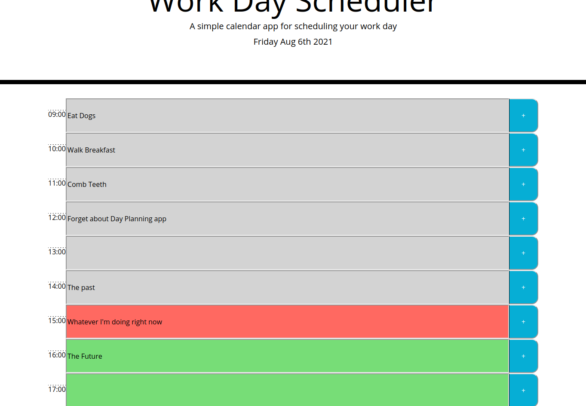

# day-planner

## Description

This project aims to create an hourly day planner that cover the standard business hours
of 9AM - 5PM. The day is dynamically set to the current date and each event can be saved
to local storage by pressing the button to the right after entering an item

To delete an item, simply delete the contents of that box and press save again, the program
makes no distinction between empty items and non-initialized ones

Each item's text box will be color-coded based on its time relative to the current hour, gray
being past, red the present and green the future

## Example

## Deployment

[Click here to deploy!](https://iatenine.github.io/day-planner/)
